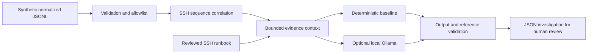

# Wazuh AI SOC Lab

[](https://github.com/Aamynn/wazuh-ai-soc-lab/actions/workflows/tests.yml)

**From security events to an evidence-linked investigation.**

A personal project rebuilding a historical Wazuh + ELK SIEM study as a testable security engineering lab. The first release provides a runnable SSH correlation demo, an optional local LLM analysis adapter, and a documented path to live Wazuh integration.

> **Status: starter implementation.** The default demo is deterministic Python, not AI. Live Wazuh ingestion, production deployment, and model-quality evaluation are not implemented. The Ollama adapter is implemented and tested with mocked responses; no model inference result or detection accuracy is claimed.

## Run the demo

Requires Python 3.9+; no third-party Python packages, credentials, or network access are needed for the default demo.

```bash
git clone https://github.com/Aamynn/wazuh-ai-soc-lab.git
cd wazuh-ai-soc-lab
python3 -m soc_lab --input sample-data/ssh-sequence.jsonl
python3 -m unittest discover -s tests -v
```

The synthetic sample contains five failed SSH logins followed by a successful login for the same host, account, and source IP within five minutes. The demo generates one investigation with six evidence references. A successful login does **not** prove compromise.

```json
{
  "incident_id": "ssh-success-001",
  "rule_id": "LAB-SSH-001",
  "assessment": "needs_review",
  "requires_human_review": true
}
```

The command prints the full JSON report, including the timeline, explanation, evidence references, runbook reference, input hash, and provenance. Save it locally if desired:

```bash
mkdir -p artifacts
python3 -m soc_lab --input sample-data/ssh-sequence.jsonl > artifacts/demo.json
python3 -m soc_lab --input sample-data/benign-logins.jsonl
```

The benign sample generates zero investigations. This is a fixture check, not an accuracy benchmark.

## What is implemented

| Capability | Status |
| --- | --- |
| Bounded JSONL input, strict normalized fields, duplicate-ID rejection | Implemented |
| Failed-logins-to-success correlation by host + account + source IP | Implemented |
| Chronological evidence timeline and deterministic explanation | Implemented |
| Local Ollama adapter with JSON schema output | Implemented; mocked transport tests |
| Output schema and evidence-reference checks | Implemented; not a semantic truth verifier |
| Reviewed SSH investigation runbook | Implemented; fixed selection, not vector RAG |
| Continuous integration | Workflow included; see Actions for actual run status |
| Live Wazuh ingestion, deployment, dashboard | Planned |
| Windows, file integrity, PowerShell, and web detections | Planned |
| Autonomous remediation | Out of scope for the starter |

## Architecture



The new code owns validation, correlation, context preparation, the provider boundary, and analysis checks. Wazuh remains an upstream detection and telemetry platform in the planned live architecture; this repository does not claim to implement Wazuh itself.

## Optional local AI

Install Ollama from its official distribution and install a **local** model appropriate for your machine. No model is downloaded or selected by this project. With Ollama running on `127.0.0.1:11434`, replace the placeholder below with an installed local model name:

```bash
python3 -m soc_lab --input sample-data/ssh-sequence.jsonl \
  --provider ollama --model YOUR_INSTALLED_LOCAL_MODEL
```

This explicitly sends the normalized evidence and bundled runbook to the local Ollama service. Cloud-tagged models are rejected; use a local-only Ollama configuration. The client disables HTTP proxies and redirects, exposes no tools, and never executes model output. The server's actual behavior is outside the client's control.

If inference fails or returns an invalid response, the investigation retains its deterministic baseline and records `fallback: true`. Inspect `provider_used`; a successful CLI exit alone does not establish that AI ran. Schema validation checks shape and known references, not factual correctness or prompt-injection immunity.

## Read more

- [Project analysis and design decisions](docs/project-analysis.md)
- [Architecture and data contract](docs/architecture.md)
- [Wazuh integration plan](docs/wazuh-integration.md)
- [AI threat model](docs/threat-model.md)
- [Evaluation plan and validation record](docs/evaluation.md)
- [Roadmap](ROADMAP.md)
- [Origin and attribution](NOTICE.md)
- [Contribution guidance](CONTRIBUTING.md)

## Project origin

The project direction comes from a 2020 academic SIEM report describing a Wazuh + ELK deployment. Original configuration/source files were not available. This repository is a new implementation inspired by that study, using invented lab events. The original PDF, organizational diagrams, screenshots, and credentials are not included.

No license grant is made yet; a license should be selected by the maintainer before advertising this repository as reusable open-source software. See [NOTICE.md](NOTICE.md).
