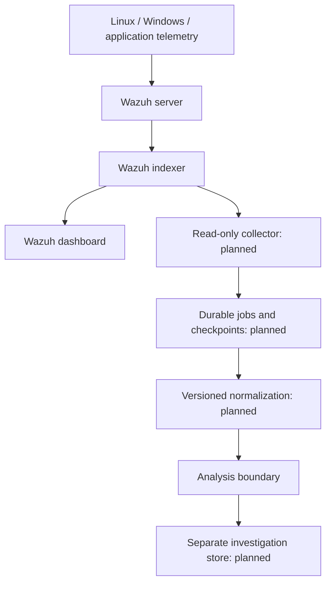

# Architecture and data contract

## Implemented path

The CLI reads at most 2 MB and 2,000 events. Each record is validated and projected onto six allowed fields. Unknown fields are dropped, identifiers are restricted, IP addresses are parsed, timestamps require a timezone, and duplicate IDs fail the batch. Invalid input exits with code 2 before inference.

```json
{"id":"event-001","timestamp":"2026-01-01T10:00:00Z","host":"lab-linux","user":"demo-user","source_ip":"192.0.2.10","event_type":"ssh_failed"}
```

Supported types: `ssh_failed`, `ssh_success`. Identifiers permit ASCII letters, digits, underscores, dots, at signs, backslashes, and hyphens, up to 128 characters. This intentionally narrow starter schema will reject some real-world identities; a live mapper must specify its normalization policy.

LAB-SSH-001 groups events by exact host, account, and canonical source IP. A success qualifies when at least five failures occur in `[success - 300 seconds, success)`. Equal timestamps are not assumed to establish order. A qualifying success creates one investigation; overlapping successes may share evidence. No IP blocking or account changes occur.

At most 20 investigations and 100 evidence events per investigation are accepted. Overflow fails clearly instead of silently truncating evidence or creating unbounded inference work. The report includes the SHA-256 of the original input bytes, normalized evidence, and the analysis provenance. The input hash is not an authenticity signature or forensic chain of custody.

The bundled runbook is selected by the implemented SSH use case. This is a fixed context lookup, not a general retrieval engine. The optional model receives the runbook, output schema, and normalized events. JSON output is validated for required fields, limits, permitted assessments, known references, sequence evidence, and required human review.

## Failure semantics

- Invalid input/configuration: nonzero exit, no report.
- Model unavailable, invalid JSON, or invalid analysis: preserve baseline, set `fallback: true`.
- Zero matches: valid report with zero investigations; no model call.
- Model summaries: untrusted suggestions. Known references do not establish that a summary follows from those references.

## Planned live path



Keep collection/detection independent from inference. Plan at-least-once processing with persistent checkpoints and unique event keys, then idempotent analysis writes keyed by incident, model, prompt, and knowledge version. Query bounded windows with an overlap for late arrivals; never advance the checkpoint until work is durably accepted.

Use a separate investigation store or index, not writes into source alerts. No long-lived database, server, authentication, multi-user interface, or collector is included in this release.
